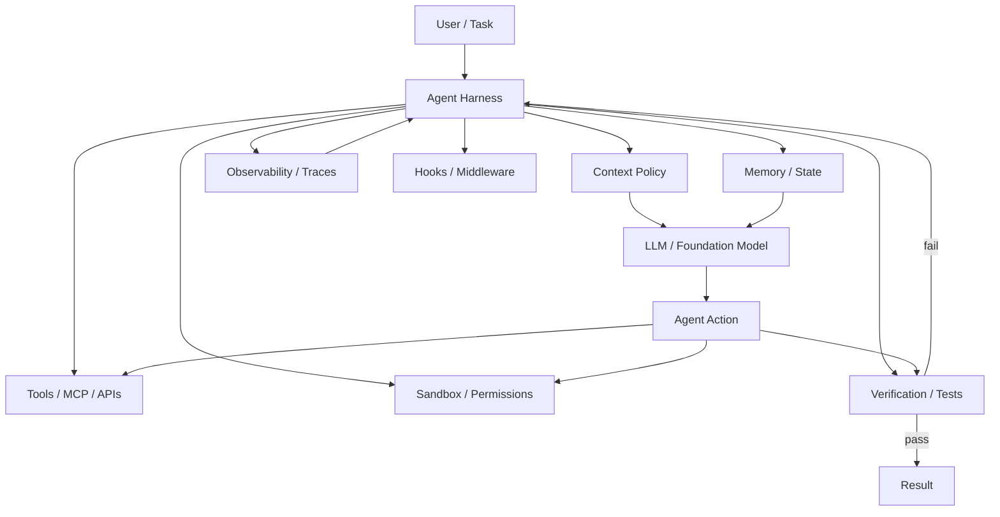
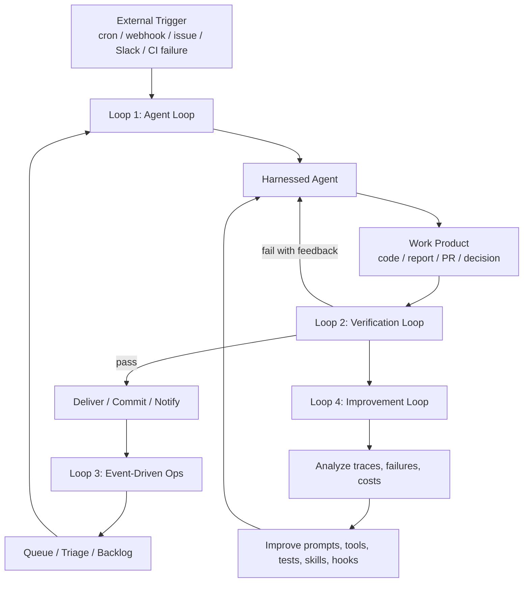

*Insight Report: Loop Engineering vs. Harness Engineering for AI Agents*

## Executive Summary

Harness engineering is the discipline of designing the runtime scaffolding around an AI agent: tools, prompts, memory, context policies, sandboxes, hooks, permissions, observability, tests, evaluators, and recovery paths.

In short:

**Agent = Model + Harness**

A model alone outputs text. A harness turns it into an operational system that can read files, call tools, execute code, persist state, observe failures, retry, and verify work. Addy Osmani describes harness engineering as treating this scaffolding as a real artifact that gets tightened whenever the agent makes a mistake.

Loop engineering is a newer layer above that. Instead of repeatedly prompting an agent yourself, you design recurring, self-driving loops that prompt, schedule, delegate, verify, and improve agent work on your behalf. Osmani describes it as replacing yourself as the person who prompts the agent and designing the system that does it instead.

The simplest relationship is:

```text
Model
  ↓
Harness Engineering
  = gives the model tools, memory, rules, permissions, tests, and observability
  ↓
Loop Engineering
  = makes the harnessed agent run repeatedly, autonomously, and improve over time
```

Harness engineering is the foundation; loop engineering is the operating model. You usually should not do serious loop engineering until you have a solid harness, because loops amplify whatever is inside them: good harnesses become productive automation, bad harnesses become expensive chaos.

## 1. What Is Harness Engineering?

Harness engineering means building the execution environment and control system around an LLM or agent so it can perform useful work reliably.

A raw LLM cannot persist state, execute code, access real-time data, install packages, inspect a repo, open a PR, or enforce safety rules by itself. LangChain’s harness explanation frames these as harness-level features: durable state, code execution, real-time knowledge, and environment setup.

A typical agent harness includes:

| Harness Component | Purpose |
|---|---|
| System prompts / AGENTS.md / CLAUDE.md / skill files | Encode project-specific rules and reusable procedures |
| Tool layer | Let the agent read files, search, run commands, call APIs, use browsers, query databases |
| Context policy | Decide what information enters the model context |
| Memory | Persist knowledge across sessions |
| Sandbox | Let the agent act safely |
| Hooks | Enforce rules before or after actions |
| Test runners / evaluators | Verify outputs |
| Observability | Record traces, costs, failures, latency, tool calls |
| Permissions | Prevent destructive or unauthorized actions |
| Recovery logic | Retry, rollback, escalate to humans |

Osmani’s harness article gives concrete examples: if the agent runs destructive commands, add a blocking hook; if it gets lost, split it into planner and executor; if it finishes broken code, wire typecheck failures back into the loop.

### Harness Engineering Architecture



The harness is not just prompting. It is the full runtime substrate.

## 2. What Is Loop Engineering?

Loop engineering means designing systems that repeatedly run agents toward a goal, with feedback, verification, scheduling, delegation, and memory.

At the basic level, every agent already has a loop:

**Think → Act → Observe → Think → Act → Observe → Done**

Modern loop engineering goes beyond a single ReAct loop. It stacks loops:

1. Agent loop: model calls tools until task is complete.
2. Verification loop: output is checked, then retried if it fails.
3. Event-driven loop: schedules, webhooks, tickets, or messages trigger new runs.
4. Improvement loop: traces and failures are mined to improve the harness.

LangChain’s *Art of Loop Engineering* describes this stack: core agent loop, verification loop, event-driven loop, and a hill-climbing loop that improves the agent system itself.

Addy Osmani’s 2026 loop engineering article describes the loop as sitting one floor above the harness: the harness runs on a timer, spawns helpers, and feeds itself.

### Loop Engineering Stack



Loop engineering is not merely running an agent in a while loop. It is about designing the feedback topology around agents.

## 3. Key Differences

| Dimension | Harness Engineering | Loop Engineering |
|---|---|---|
| Main question | What environment and guardrails does the agent need to succeed? | How should agents repeatedly work, verify, delegate, and improve without manual prompting each step? |
| Layer | Runtime substrate | Operating cycle |
| Core artifact | Tools, prompts, memory, permissions, hooks, tests, traces | Schedules, goal loops, verification cycles, task queues, sub-agent workflows, improvement loops |
| Primary goal | Make one agent run reliably | Make repeated agent work scalable |
| Failure mode | Agent cannot act, forgets, violates rules, produces unverifiable output | Agent loops forever, burns tokens, compounds mistakes, creates noisy automation |
| Analogy | Build the factory floor, machines, safety rails, sensors | Design the production line and feedback cycles |
| Best first investment | For almost every serious agent project | After harness basics are stable |

A useful mental model:

```text
Harness engineering = capability + safety + observability
Loop engineering    = autonomy + recurrence + delegation + improvement
```

## 4. Why These Terms Matter Now

The industry is moving from chat with an AI to managing AI workers. Business Insider reported in June 2026 that practitioners around Claude Code, Codex, and agentic coding are increasingly talking about loops instead of hand-written prompts, with examples such as goal-seeking agents, scheduled repo maintenance, and maker/checker agent splits.

At the same time, harness engineering has become a serious discipline because model quality alone does not determine agent performance. Osmani argues that a decent model with a great harness beats a great model with a bad harness, and describes the harness as prompts, tools, context policies, hooks, sandboxes, subagents, feedback loops, and recovery paths around the model.

So the shift is:

- 2023: Prompt engineering
- 2024-2025: Context engineering + tool use
- 2025-2026: Harness engineering
- 2026+: Loop engineering / loopcraft / agent operations

Prompting is not dead; it is now one part of a larger system.

## 5. Concrete Example: Coding Agent

### Harness Engineering Example

You want a coding agent to modify a TypeScript repo.

You build a harness with:

- Repo access
- Git worktree isolation
- Bash execution
- TypeScript compiler
- Unit test runner
- Lint command
- File-edit tool
- Security policy: no force push, no destructive rm
- AGENTS.md with coding standards
- Trace logging
- Diff reviewer
- Human approval before merge

Now the agent can work safely and produce verifiable changes.

### Loop Engineering Example

Now you design loops on top:

1. Scan open GitHub issues each morning.
2. Classify easy bug fixes.
3. Spawn one agent per issue in separate worktrees.
4. Run tests and lint.
5. Ask a reviewer sub-agent to inspect the diff.
6. Open PRs only if checks pass.
7. Summarize results to Slack.
8. Save failures into a harness-improvements backlog.

This is no longer just an agent. It is an autonomous workflow.

## 6. Pros and Cons

### Harness Engineering: Pros

1. Reliability improves at the root. Every mistake can become a harness improvement: a new rule, hook, evaluator, test, or permission boundary. Osmani calls this the ratchet.
2. Lower risk than full autonomy. You can improve the environment without fully unattended runs.
3. Better observability. A good harness provides traces, logs, cost data, tool-call history, and failure attribution.
4. More portable than prompts. Harness assets can outlive any single model.
5. Essential for production. If you cannot observe, constrain, and verify an agent, you probably should not automate it.

### Harness Engineering: Cons

1. Upfront engineering cost.
2. Risk of overfitting to one model, repo, or workflow.
3. Hidden complexity as the harness grows.
4. Ongoing maintenance burden.

### Loop Engineering: Pros

1. Scales human intent by replacing repetitive manual prompting.
2. Fits recurring work: triage, monitoring, regression checks, docs, CI analysis, and review.
3. Enables maker/checker patterns.
4. Enables autonomous improvement loops.
5. Turns agents into operations connected to real triggers.

### Loop Engineering: Cons

1. Token and cost explosion.
2. Error amplification if the underlying harness is weak.
3. Autonomy risk for production-touching actions.
4. Loop drift and metric over-optimization.
5. Harder debugging due to timing, memory, verification, and tool side effects.

## 7. Side-by-Side Decision Matrix

| Use Case | Prefer Harness Engineering | Prefer Loop Engineering |
|---|---|---|
| First version of an agent framework | Strong yes | Not yet |
| Coding assistant for one repo | Strong yes | Later |
| Automated daily issue triage | Yes | Strong yes |
| One-off research task | Medium | Low |
| CI failure diagnosis | Yes | Strong yes |
| Autonomous PR creation | Strong yes | Strong yes |
| Production customer-support agent | Strong yes | Medium/strong, with strict controls |
| Internal knowledge assistant | Strong yes | Medium |
| Agent evaluation platform | Strong yes | Strong yes |
| Long-running multi-agent workflow | Strong yes | Strong yes |
| Highly regulated workflow | Strong yes | Only with human approval gates |

Rule of thumb:

- If the problem is agent unreliability, improve the harness.
- If the problem is manually driving repeated work, design a loop.

## 8. Maturity Ladder

### Level 0: Prompt-Only

Human → prompt → model → answer

Good for exploration; weak for repeatability.

### Level 1: Context Engineering

Human → curated context → model → answer

You improve input quality with examples, docs, retrieval, and schemas.

### Level 2: Harness Engineering

Human → harnessed agent → tools/tests/memory/observability → verified output

The agent can act and self-check in a controlled environment.

### Level 3: Loop Engineering

Trigger → harnessed agent loop → verification → delivery → trace analysis → next run

The agent becomes part of an operational system.

### Level 4: Self-Improving Agent System

Loops generate traces → traces improve harness → improved harness improves future loops.

Powerful but risky. Requires strong review, evals, rollback, and cost controls.

## 9. Practical Architecture for a TypeScript LLM-Agent Framework

Given your interest in TypeScript hooks and non-invasive monitoring for LLM agents, this architecture is a practical baseline:

```text
Core agent runtime
  ↓
Harness layer
  - tool registry
  - context manager
  - memory adapter
  - permission engine
  - hook/middleware system
  - trace collector
  - evaluator interface
  - sandbox adapter
  ↓
Loop layer
  - scheduler
  - event triggers
  - task queue
  - retry policy
  - verifier loop
  - sub-agent orchestration
  - human approval gates
  - improvement backlog
```

## 10. Best Practices

### For Harness Engineering

1. Start from failures, not abstractions.
2. Make success silent and failure verbose.
3. Use deterministic checks wherever possible.
4. Separate action from permission.
5. Trace everything.

### For Loop Engineering

1. Never loop without a stop condition.
2. Separate maker and checker.
3. Prefer narrow recurring loops.
4. Use work isolation.
5. Require human approval for irreversible actions.
6. Track loop economics.

## 11. Main Risks and Mitigations

| Risk | More Related To | Mitigation |
|---|---|---|
| Agent forgets project rules | Harness | Persistent memory, skill files, context policy |
| Agent runs unsafe command | Harness | Permission engine, command denylist, sandbox |
| Agent produces broken output | Harness + Loop | Tests, verifier loop, reviewer agent |
| Agent loops forever | Loop | Max iterations, timeout, budget cap |
| Costs explode | Loop | Token budget, cheaper model for triage, deterministic checks |
| Bad output gets shipped repeatedly | Loop | Human approval, staged rollout, regression tests |
| Debugging is impossible | Harness | Structured traces and run replay |
| Multi-agent conflicts | Loop | Task ownership, isolated workspaces, merge protocol |
| Evaluation becomes subjective | Harness | Rubrics plus deterministic assertions |
| System becomes over-engineered | Both | Add harness features only after real failures |

## 12. Strategic Conclusion

Harness engineering and loop engineering are not competitors. They are two layers of the same agent-systems discipline.

- Prompt engineering asks: How do I ask the model better?
- Context engineering asks: What information should the model see?
- Harness engineering asks: What system around the model lets it act safely and reliably?
- Loop engineering asks: How do I make that reliable agent operate repeatedly, autonomously, and improve?

For most teams, the right sequence is:

1. Build a minimal agent.
2. Add harness features when real failures appear.
3. Add observability and verification.
4. Only then add recurring loops.
5. Use traces from loops to improve the harness.

The biggest insight: loop engineering without harness engineering is premature automation. Harness engineering without loop engineering is a powerful tool that still depends on human steering. The best systems combine both: a strong harness for reliability, and carefully bounded loops for scale.
