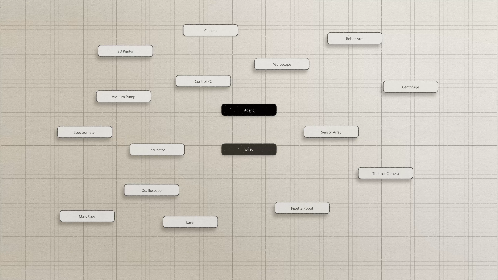
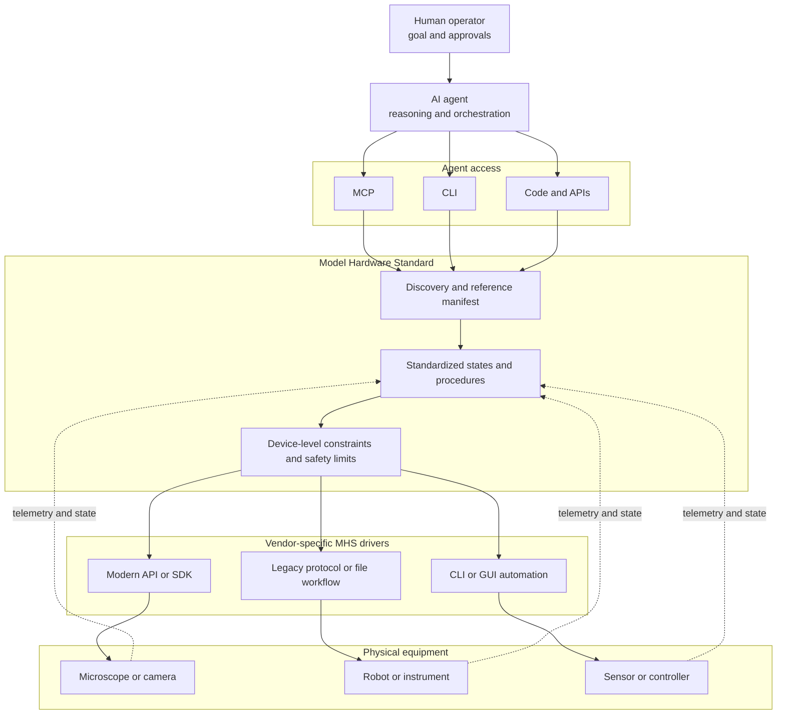
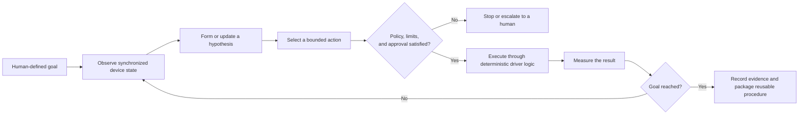
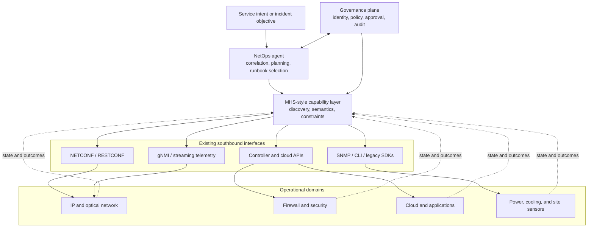

## What is the Model Hardware Standard?

Anthropic introduced the Model Hardware Standard, or MHS, as a shared specification through which AI agents can discover, understand, monitor, and safely operate physical equipment.

MHS began as a collaboration with the HHMI Janelia Research Campus and is currently a limited research preview. Its early users are primarily scientific laboratories, robotics companies, and advanced manufacturers. Anthropic says it plans to open-source the standard after working with preview partners on safety evaluations and deployment practices.

The immediate problem MHS addresses is hardware fragmentation. A laboratory or factory may contain equipment from many vendors, with every device exposing a different API, SDK, desktop application, command format, or data representation. Connecting those devices normally requires bespoke integration code and specialist knowledge.

MHS introduces a standardized driver layer that translates those vendor-specific interfaces into a shared operational model. Anthropic reports that this can reduce some integrations from weeks or months to hours or minutes. In one Carnegie Mellon demonstration, researchers integrated a robotic arm, liquid handler, plate reader, and cameras across three computers in approximately eight hours. The underlying interfaces included a watched directory, Windows COM automation, USB devices, and GUI-only software—not a uniform collection of modern APIs.

That example captures the central value of MHS: it does not make legacy interfaces disappear; it hides their differences behind a common, agent-readable contract. [Anthropic's full MHS announcement](https://www.anthropic.com/news/model-hardware-standard-research-preview)



*The video presents MHS as a common interface connecting otherwise separate devices. Frame from Anthropic's [MHS overview video](https://www.youtube.com/watch?v=UxJZrCFzTHY), approximately 00:49. © Anthropic; reproduced here for commentary and analysis.*

## How MHS works

MHS is easiest to understand as an agent-oriented abstraction above the interfaces that already control equipment.



### A standardized driver

Each device still needs a driver that translates between MHS and its native control interface. That interface might be an API, SDK, command-line utility, shared-memory program, legacy automation protocol, watched directory, or another programmable mechanism.

The driver exposes basic operations for reading a value, changing a setting, or invoking a procedure. The higher layers therefore receive a consistent interface even when the equipment underneath is incompatible.

It would be inaccurate to say that MHS lets software access hardware “instead of using an API.” MHS normally sits above the API—or whatever control mechanism the device already provides.

### Discoverable states, procedures, and constraints

An MHS driver describes a device in a machine-readable manifest. Anthropic's examples refer to:

- **States:** Observable values and conditions such as temperature, position, readiness, alarms, and whether the device is busy.
- **Procedures:** Operations the device can perform, such as measuring, moving, calibrating, starting, stopping, or resetting.
- **Characteristics:** Context that may not be inferable from code, including physical properties and operating requirements.
- **Safety limits:** Boundaries that must be enforced regardless of what an AI agent requests.

Natural-language tags can capture information that previously existed only in manuals or an operator's experience. MHS uses this context to generate reference information explaining what a device measures, what can be changed, and what limits apply.

This is important because tool access alone is not enough. An agent must understand the meaning and likely consequences of the available operations.

### Different mechanisms for different timescales

Anthropic describes three mechanisms for controlling MHS-connected devices: Model Context Protocol, command-line interfaces, and code files or APIs.

These mechanisms serve different timescales. An agent can inspect state and make high-level decisions through MCP. An operator can use a CLI for direct work. A fast or long-running workflow can be packaged as deterministic code that invokes several driver operations without requiring another model inference at every step.

This separation is essential. An LLM should not sit inside every millisecond-level control loop. It is better suited to selecting goals, diagnosing unexpected conditions, choosing between runbooks, and improving procedures. Time-sensitive execution should remain in deterministic software or the device itself.

The [MHS video](https://www.youtube.com/watch?v=UxJZrCFzTHY) says that connected devices can communicate at “bare-metal speed” while the agent receives context and controls operations. The practical interpretation is not that LLM reasoning runs at hardware speed. Device-to-device communication and compiled control logic remain fast while the model works at a slower supervisory layer.


*The agent analyzes a microscope image while coordinating autofocus and stage movement, illustrating the observe–reason–act loop over physical equipment. Frame from Anthropic's [MHS overview video](https://www.youtube.com/watch?v=UxJZrCFzTHY). © Anthropic; reproduced here for commentary and analysis.*

## From natural-language intent to a constrained control loop

Once devices expose consistent state and control interfaces, an agent can implement a closed loop rather than issue a one-off command.



The video shows Claude focusing a microscope, locating bacteria, and deciding what to capture next. It also describes a Genentech workflow in which a scientist supplied an experimental protocol as a PDF and Claude coordinated the equipment required to execute it.

The deeper lesson is not merely that natural language can control hardware. It is that high-level intent can be translated into an observable, constrained, and repeatable control loop.


*The Genentech demonstration coordinates a liquid-handling workstation from a scientist-authored protocol and includes unattended error recovery. Frame from Anthropic's [MHS overview video](https://www.youtube.com/watch?v=UxJZrCFzTHY). © Anthropic; reproduced here for commentary and analysis.*

## What the early demonstrations reveal

The most relevant result for ICT operations comes from QuEra's laser-control experiment.

QuEra already had a deterministic recovery script for restoring a laser's frequency lock. A multidisciplinary team had spent months developing it, but the script succeeded only about 58% of the time and took approximately 150 seconds per attempt.

Using MHS, Claude repeatedly tested the physical system, examined the results, and rewrote the recovery procedure. The resulting decision tree completed simpler recoveries in seconds and achieved a 99.3% success rate across 700 blind trials.

Crucially, the final production artifact was not an LLM making every operational decision. It was a deterministic, inspectable script discovered through agent-driven experimentation.

That suggests a compelling pattern for ICT:

> Use the agent to investigate, experiment, and improve a recovery strategy; then compile the successful strategy into a reviewed, deterministic runbook for production.

This is safer and more scalable than allowing a general-purpose agent to improvise directly against production infrastructure indefinitely.

The demonstrations also expose limitations. Claude sometimes misunderstood physical failures, required extensive contextual information, or stopped while waiting for human approval. Anthropic acknowledges that MHS remains a research preview and that its physical-safety framework is still being developed.

## How MHS relates to existing network standards

The networking industry already has mature southbound protocols and data models:

- NETCONF retrieves and modifies network-device configuration.
- RESTCONF exposes YANG-modeled data through HTTP.
- YANG formally models configuration, operational state, actions, and notifications.
- gNMI provides structured configuration and streaming telemetry.
- SNMP, controller APIs, cloud APIs, vendor SDKs, and CLI automation remain widely deployed.

[NETCONF](https://www.rfc-editor.org/rfc/rfc6241), for example, already defines a formal API for reading and manipulating configuration, including capabilities such as locking, validation, confirmed commits, and rollback on error. MHS should not be positioned as a replacement for NETCONF, YANG, gNMI, or vendor controllers.

A more accurate positioning is:

> Network protocols describe how software communicates with network systems. MHS could describe how an AI agent discovers their capabilities, interprets their operational meaning, applies safety constraints, and coordinates them with other systems.

An MHS driver for a router might internally use NETCONF for configuration, gNMI for telemetry, a vendor API for optical diagnostics, and SSH for one legacy operation. To the agent, these could appear as a consistent collection of states and procedures.



The value therefore sits above the protocol layer: semantic normalization, capability discovery, cross-domain orchestration, and agent-safe operation.

## Potential impact on ICT and Network Operations

### Faster integration—not automatically faster device access

NetOps platforms frequently maintain separate integrations for routers, switches, optical equipment, firewalls, radio systems, power infrastructure, and environmental sensors. The burden increases when vendors expose equivalent operations with different names, units, schemas, and error models.

MHS could let each device class be onboarded once and exposed through a shared operational vocabulary: read interface state, obtain optical power, validate a configuration candidate, run a diagnostic, restart a service, or roll back a change.

The main improvement would be development velocity and reuse. MHS does not inherently make NETCONF or gNMI transactions faster; another abstraction may even introduce overhead. The speedup comes from reducing bespoke integration work and letting the same workflow operate across more systems.

### Cross-domain incident correlation

Network incidents rarely remain inside one tool or device category. A service outage might involve routing state, an optical link, a firewall policy, Kubernetes, DNS, power, and a physical sensor at a remote site.

An MHS-style layer could let an agent inspect those domains through a common capability model. It might determine that packet loss coincides with degraded optical receive power and a rising transceiver temperature, recommend a traffic reroute, execute an approved runbook, and verify that customer-facing indicators recover.

That would move AIOps from alert summarization toward evidence-based, cross-layer diagnosis.

### Safer closed-loop remediation

MHS could place operational limits next to the action instead of relying only on prompt instructions. A network-facing driver might enforce rules such as:

- Never remove the last route to the management network.
- Do not shut down both members of a redundant pair.
- Require approval for actions affecting more than a defined number of customers.
- Permit autonomous remediation only for tested failure signatures.
- Abort if observed state differs from the pre-change snapshot.
- Automatically roll back if service-level indicators deteriorate.

The driver and execution platform—not the LLM—must enforce these controls. A prompt asking an agent to “be careful” is not an operational safety mechanism.

Production use would also require identity, role-based access control, secrets management, change management, configuration locks, transactional commits, canary deployment, complete audit logs, and out-of-band recovery.

### Better AIOps research and operational learning

Standardized data is easier to combine, but standardization does not guarantee sensor accuracy, synchronized timestamps, correct labels, or representative failure scenarios.

The more important benefit is the ability to capture structured operational trajectories:

```text
state → hypothesis → action → resulting state → success or failure
```

These trajectories show not only what happened but which action was attempted, under which constraints, and whether it improved the system.

In an ICT lab or digital twin, agents could induce controlled faults, test recovery strategies, compare outcomes, and convert successful strategies into validated runbooks. This resembles the QuEra experiment: the model acts as an accelerated operations researcher while production receives deterministic automation.

### Hardware-independent intent

One MHS demonstration allowed a protocol to request a capability without naming a machine. The system discovered compatible equipment and translated the requested physical value into the parameters that device accepted.

The network equivalent is intent-based operation. An operator could ask the system to move a service away from a degraded path while preserving latency and capacity requirements. The agent could discover which routers, controllers, optical systems, or SD-WAN platforms can satisfy the intent and translate it into vendor-specific actions.

Intent can remain hardware-independent, but execution must remain hardware-aware. Device-specific constraints, failure modes, and rollback behavior cannot safely be abstracted away completely.

## Where MHS could be applied first

The safest near-term ICT applications are read-heavy and advisory:

1. Unified discovery and inventory
2. Cross-vendor telemetry normalization
3. Incident investigation and evidence collection
4. Runbook selection and parameter preparation
5. Pre-change validation
6. Post-change service verification
7. Lab-based fault injection and remediation research

The next stage could allow bounded actions with clear rollback paths, including clearing a stuck process, rerouting a limited amount of traffic, isolating a failed access device, applying a pre-approved template, or executing a known recovery procedure.

Network-wide autonomous change should come later, after the driver ecosystem, security architecture, safety evaluations, and operational governance are mature.

## Challenges and risks

### Security

A standardized control layer becomes a high-value attack surface. Device discovery, driver packages, natural-language metadata, agent context, and MCP connections must all be treated as potentially hostile inputs. Strong authentication, signed drivers, least-privilege authorization, segmentation, and complete auditability are essential.

### Semantic correctness

Two devices may expose an operation with the same name but different behavior. A production standard needs formal types, units, versions, preconditions, postconditions, side-effect declarations, idempotency information, and failure semantics. Natural-language descriptions are useful context, not a substitute for formal contracts.

### Real-time constraints

Routing convergence, radio scheduling, protection switching, and hardware control often operate on timescales unsuitable for model reasoning. Those loops must remain in network operating systems, controllers, or deterministic programs. The agent should work at supervisory and optimization layers.

### Governance and accountability

Every autonomous action needs a traceable identity, justification, approval state, evidence set, affected scope, and measured outcome. Organizations must also determine who owns an agent-generated runbook and who is accountable when it fails.

### Maturity

MHS is a research preview, not yet an established industry standard. Anthropic's announcement supplies conceptual and experimental detail, but the final open specification, conformance tests, security architecture, governance model, and long-term vendor support are not yet publicly available.

## Conclusion

MHS is not simply another hardware API. Its more important contribution is a possible contract between AI agents and the physical world: a device describes what it is, what state it is in, what it can do, and what it must never be allowed to do.

For ICT and Network Operations, MHS should not replace existing protocols. Its potential role is to sit above them, turning fragmented interfaces into discoverable, semantically meaningful, and safety-constrained operational capabilities.

The most promising outcome is not an LLM continuously improvising against a production network. It is a hybrid model in which agents investigate unfamiliar problems, coordinate evidence across domains, and improve remediation strategies, while deterministic systems enforce policy and execute production changes.

If MHS matures into a secure, open, vendor-supported ecosystem, it could help move AIOps beyond dashboards and recommendations toward adaptive—but controlled and auditable—autonomous operations.

## Sources

- Anthropic, [Previewing the Model Hardware Standard](https://www.anthropic.com/news/model-hardware-standard-research-preview), August 27, 2026.
- Anthropic, [Model Hardware Standard: AI operating physical equipment](https://www.youtube.com/watch?v=UxJZrCFzTHY), video.
- IETF, [RFC 6241: Network Configuration Protocol (NETCONF)](https://www.rfc-editor.org/rfc/rfc6241).
- IETF, [RFC 7950: The YANG 1.1 Data Modeling Language](https://www.rfc-editor.org/rfc/rfc7950).
- IETF, [RFC 8040: RESTCONF Protocol](https://www.rfc-editor.org/rfc/rfc8040).
- OpenConfig, [gNMI Specification](https://github.com/openconfig/reference/blob/master/rpc/gnmi/gnmi-specification.md).
