> **Based on**: [How To Get Your First Users](https://www.youtube.com/watch?v=0kARDVL2nZg) — Y Combinator
>
> **Core Insight**: Finding initial customers is a **search problem**, not a persuasion problem.

Building a successful startup begins with a fundamental shift in mindset. Instead of seeking broad audience appeal, founders must identify a small group of early adopters—individuals driven by a "burning need" who are willing to overlook early flaws in exchange for a solution. These first adopters act as environmental pressure, steering product evolution the same way simple organisms evolve toward complexity.

```mermaid
graph TD
    A["Most Companies<br/>(Persuasion Mindset)"] -->|❌ Inefficient| B["Try to convince<br/>general audience"]
    C["Successful Startups<br/>(Search Mindset)"] -->|✅ Effective| D["Find specific<br/>early adopter<br/>archetypes"]
    B --> E["High CAC<br/>Low conversion"]
    D --> F["High engagement<br/>Rich feedback"]
```



## 1.0 Introduction: Adopting a "Search, Don't Persuade" Philosophy

**The Challenge**: Most people are not early adopters. Almost no one actively seeks to be the first paying customer for an unproven product.

**The Reframe**: This reality transforms our task from mass-market persuasion into **focused search**.

### The Minimum Evolvable Product (MEP) Approach

Rather than building a perfect final product, we build an **initial version** that can:

- ✓ Survive first contact with users
- ✓ Evolve based on real feedback
- ✓ Attract specific external pressures that guide evolution

Think of an early-stage startup as an **amoeba**—possessing only basic functions, exposed to external pressures that force evolution. The MEP is the simplest possible thing we can build to attract those specific pressures.

**Next: Clearly define the profile of users we're searching for.**

## 2.0 Defining the Early Adopter Profile: Identifying Our Target Users

A targeted search is far more effective than attempting broad, mass-market appeal. We are searching for specific user archetypes who are uniquely receptive to new and unproven products.

### The Two Primary Early Adopter Profiles

```mermaid
graph LR
    A["Early Adopter<br/>Target"] --> B["The Enthusiast"]
    A --> C["The User with<br/>a Burning Problem"]
    
    B --> D["🎯 Loves new tech<br/>🎯 Seeks cutting edge<br/>🎯 Motivated by novelty"]
    C --> E["🎯 Desperate to solve<br/>a specific problem<br/>🎯 Price-insensitive<br/>🎯 Ready to act now"]
    
    D --> F["Example: Gustaf<br/>Airbnb employee<br/>who enjoys discovering<br/>& introducing new tools"]
    E --> G["Example: Ankit<br/>Needed inference API<br/>quickly, no patience<br/>for setup complexity"]
```



**The Enthusiast**

- Gains satisfaction from being on the cutting edge
- Loves trying new products and technologies
- *Example*: Gustaf, a former Airbnb employee who actively enjoyed trying startup products and introducing them internally

**The User with a Burning Problem**

- Has a severe, pressing issue they're desperate to solve
- Willing to try any credible solution
- *Example*: Ankit needed an inference API quickly without dealing with billing/setup complexity—he became a first paying customer instantly

### The Strategic Implication

Early success is **not** dependent on:

- ❌ Brand recognition
- ❌ Market validation
- ❌ Large user base

Early success **is** dependent on:

- ✅ Solving a specific, acute problem
- ✅ Finding users actively looking for a solution
- ✅ Understanding your target archetypes deeply

## 3.0 Core Principles for Early User Engagement and Learning

Our engagement with early users will be governed by **five core principles** designed to maximize learning over premature growth. Standard marketing playbooks don't apply here.

```mermaid
graph TB
    A["Five Core Principles<br/>for Early Users"] --> B["💰 Charge Real Money Early"]
    A --> C["🎯 Employ Targeted,<br/>Personal Outreach"]
    A --> D["🚀 Launch Early &<br/>Engineer Serendipity"]
    A --> E["🔬 Study Users Like<br/>an Anthropologist"]
    A --> F["⚡ Experiment Fast &<br/>Don't Fear Churn"]
    
    B --> B1["Sharper Feedback<br/>from Paying Customers"]
    C --> C1["High Signal vs<br/>Noisy Broadcast"]
    D --> D1["Wide Surface Area<br/>for Discovery"]
    E --> E1["Deep Empathy &<br/>Insight"]
    F --> F1["Rapid Learning &<br/>Evolution"]
```



### Principle 1: Charge Real Money Early

**Why it matters**: Paying customers provide "sharper feedback" than free users ever will. A customer who has invested money is more likely to articulate their needs and frustrations clearly.

**Key insight**: Early adopters and users with burning problems are rarely price-sensitive. Their primary concern is solving their problem, not finding the cheapest option.

### Principle 2: Employ Targeted, Personal Outreach

**Why it matters**: Broad, impersonal marketing is ineffective for reaching our target profiles.

```
"A billboard is far less likely to connect with our ideal user
than a targeted cold email or a knock on their door."
```

Our outreach must be:

- 🎯 **Personal** — One-to-one
- 🎯 **Direct** — Not through intermediaries  
- 🎯 **Focused** — On specific individuals and companies that fit our archetypes

### Principle 3: Launch Early and Engineer Serendipity

**Why it matters**: In initial stages, we don't know exactly who our first users will be or where they'll come from.

**The advantage of early launch**:

- Creates a "wide surface area" for organic discovery
- Enables market interaction sooner
- Accelerates learning through real-world contact

### Principle 4: Study Early Users Like an Anthropologist

**Why it matters**: We need more than behavioral data—we need **deep empathy**.

**Critical questions**:

- How do they think?
- How do they make decisions?
- Why would they make the "strange choice" to trust an unknown startup?

This anthropological understanding will be invaluable in shaping a product they'll truly love.

### Principle 5: Experiment Fast and Don't Fear Churn

**Our advantage**: As a startup, we can run constant experiments without risk of negative headlines.

**What we'll test**:

- Pricing structures
- Feature sets
- Onboarding flows
- Landing pages

**Key mindset**: While we strive to make users love the product, we **won't fear churn**. The personal nature of early relationships means we can often fix problems. If users churn, that's valuable data—and there are plenty of other potential users who haven't yet heard of us.

### The Result

By adhering to these principles, we turn our first users into **de facto members of our product team**, ensuring their insights directly influence our product's strategic direction and identity.

## 4.0 The Path-Dependent Nature of Product Evolution

**Key concept**: The users we acquire today dictate the product we can build tomorrow.

Our first users do more than provide feedback—they **actively steer the long-term evolution** of our product. Initial pressures determine future characteristics, like how simple organisms evolve based on environmental forces.

### The Tesla Roadster Case Study

```mermaid
graph LR
    A["Search Algorithm:<br/>Find people crazy enough<br/>to buy a $150k car with<br/>limited range, cargo,<br/>charging, & weird styling"] 
    A --> B["Early Adopter Filter:<br/>Tech enthusiasts &<br/>performance fanatics"]
    B --> C["Influence on Product DNA:<br/>Prioritized acceleration<br/>& technology over<br/>comfort & practicality"]
    C --> D["Long-term Evolution:<br/>Model Y has<br/>Lamborghini-level 0-60<br/>but Toyota-level suspension"]
    
    D --> E["The 'So What?':<br/>Not an accident—<br/>outcome of the<br/>search algorithm"]
```



**What this tells us**:

| Aspect | Reality |
|--------|---------|
| **Was it planned?** | No—The Roadster was Tesla's Minimum Evolvable Product |
| **Was it designed for mass market?** | No—Designed for a very specific user profile |
| **Who shaped the final product?** | The first users and their extreme demands |
| **Is product change inevitable?** | Yes—And that's liberating! |

### The Liberation of Path Dependency

**The good news**: Your initial product doesn't need to be perfect because what it ultimately becomes depends entirely on **who you begin with**.

This reframes the entire endeavor:

- ✅ Start with the right archetype
- ✅ Let them guide evolution
- ✅ Trust the feedback loop
- ✅ Accept that massive change is coming

## 5.0 Justification for an Initial B2B or Prosumer Focus

To execute this strategy effectively, we must select an initial market where users have demonstrated willingness and ability to pay for software solutions.

### The Market Economics Analysis

```mermaid
graph TB
    subgraph CONSUMER["🏠 CONSUMER MARKET"]
        C1["Average Personal<br/>Software Spend:<br/>~$150/month"]
        C2["Challenges:<br/>• Tiny budget<br/>• Ad revenue ≠ AI costs<br/>• Subscription fatigue<br/>• Competitive squeeze"]
    end
    
    subgraph BUSINESS["💼 BUSINESS MARKET"]
        B1["Corporate Software Spend:<br/>Much larger per tool<br/>Multiple tools per company"]
        B2["Advantages:<br/>• Budgets for solutions<br/>• Price-insensitive<br/>• Faster decision-making<br/>• Higher LTV"]
    end
    
    CONSUMER --> RESULT1["❌ Uphill battle<br/>for new products"]
    BUSINESS --> RESULT2["✅ Natural fit for<br/>startups"]
```



### Key Market Insights

| Dimension | Consumer | Business |
|-----------|----------|----------|
| **Total Software Budget** | ~$150/month | Corporate card with multiple tools each costing $100+ |
| **Decision Process** | Long, deliberate | Faster (when solving real problem) |
| **Price Sensitivity** | High | Low (for right solution) |
| **AI Cost Reality** | Ad revenue doesn't cover costs | Easier unit economics |
| **Current Trend** | Subscription fatigue | Growing software stack |

### Our Market Choice

**Initial go-to-market will target:**

- 🎯 **Businesses** of any size
- 🎯 **Prosumers** (professional consumers)
- 🎯 **High-value professional roles** (doctors, engineers, etc.) who can justify the cost

This isn't limiting ourselves—it's **matching our solution to users with buying power and urgency**.

## 6.0 Conclusion and Next Steps

### The Strategy in Summary

Our approach is **not a marketing campaign—it is a targeted search**.

```mermaid
graph TB
    A["SEARCH<br/>Mindset"] --> B["Find Specific<br/>Archetypes"]
    B --> C["Enthusiasts &<br/>Users with<br/>Burning Problems"]
    C --> D["Target: B2B<br/>or Prosumer<br/>Markets"]
    
    D --> E["ENGAGE<br/>with 5 Core<br/>Principles"]
    E --> F["• Charge real money<br/>• Personal outreach<br/>• Launch early<br/>• Deep learning<br/>• Fast experiments"]
    
    F --> G["EVOLVE<br/>Path-Dependent<br/>Evolution"]
    G --> H["First users shape<br/>long-term product<br/>DNA"]
    
    H --> I["BUILD<br/>the Future<br/>with Users"]
    I --> J["Co-create with<br/>early adopters as<br/>product team members"]
```



### Key Takeaways

| Concept | Key Message |
|---------|-------------|
| **Mindset** | Search, don't persuade |
| **Product** | MEP—Minimum Evolvable Product |
| **Users** | Enthusiasts & users with burning problems |
| **Engagement** | Personal, targeted, at-scale experiments |
| **Perspective** | First users = co-creators, not just customers |
| **Market** | B2B/Prosumer where buying power exists |
| **Outcome** | Users shape your product's DNA |

### Immediate Next Steps for the Team

The entire team must internalize the **Minimum Evolvable Product philosophy**.

We will now begin executing:

1. **Targeted, personal outreach** to identified early adopter archetypes
2. **Rapid experimentation cycles** across pricing, features, and onboarding
3. **Deep anthropological study** of early user behaviors, needs, and decision-making
4. **Early launch** to create surface area for serendipitous discovery
5. **Real charging** to ensure sharp feedback loops

---

**Remember**: Your first users aren't just customers—they're the architects of your company's future. Choose them wisely, listen deeply, and let them guide your evolution.
